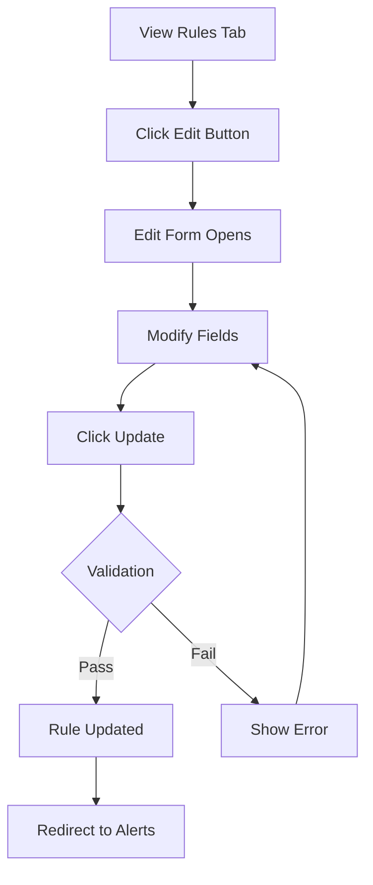

# Alert Management - Complete Guide

## 🎯 Overview

Your alerting system now has three powerful new features:
1. **Automatic Alert Resolution** - Alerts resolve when conditions clear
2. **Edit Alert Rules** - Modify existing rules without recreating them
3. **Alert Detail Modal** - Click any alert to see comprehensive details

---

## 🔄 How Alert Resolution Works

### Automatic Resolution

**Alerts resolve automatically when the metric condition clears.** You don't need to manually resolve alerts!

### The Resolution Process

```
1. Alert is FIRING
   └─ Metric: CPU usage = 92%
   └─ Threshold: > 80%
   └─ Condition: MET ✓

2. System checks every 10 seconds
   └─ Evaluation engine runs continuously

3. Condition clears
   └─ Metric: CPU usage = 65%
   └─ Threshold: > 80%
   └─ Condition: NOT MET ✗

4. Alert automatically RESOLVES
   └─ State changes to "Resolved"
   └─ Moves to History tab
   └─ Alert bell badge decreases
```

### Example Resolution Scenarios

#### Scenario 1: High CPU Alert
```yaml
Rule: CPU > 80% for 30 seconds
Current State: FIRING (CPU at 92%)

What happens when CPU drops:
- CPU drops to 65%
- System detects condition no longer met (10s check)
- Alert automatically resolves
- Appears in History tab
```

#### Scenario 2: Low Disk Space
```yaml
Rule: Disk usage > 90% for 2 minutes
Current State: FIRING (Disk at 94%)

Resolution:
- Free up disk space (delete files, clean cache)
- Disk usage drops to 85%
- Within 10 seconds, alert resolves
- No manual intervention needed
```

#### Scenario 3: Database Connections
```yaml
Rule: Active DB connections > 100 for 30s
Current State: FIRING (120 connections)

Resolution:
- Close idle connections
- Connection count drops to 85
- Alert resolves automatically
- Can be viewed in history
```

### Key Points

✅ **Automatic:** No manual resolution required  
✅ **Fast:** Checks every 10 seconds  
✅ **Reliable:** Based on actual metric values  
✅ **Traceable:** Full timeline preserved in history  

❌ **Not Instant:** May take up to 10 seconds to detect resolution  
❌ **Cannot Force:** Cannot manually mark as resolved (it must actually clear)  

### How to Speed Up Resolution

1. **Fix the underlying issue:**
   - High CPU → Stop resource-heavy processes
   - High memory → Clear caches, restart services
   - High disk → Delete files, clean up logs

2. **Verify metric values:**
   - Check Performance dashboard
   - Ensure metric is below/above threshold
   - Wait for next evaluation cycle (max 10s)

3. **Check alert details:**
   - Click on alert for current values
   - See exact threshold and current reading
   - Monitor in real-time

---

## ✏️ Editing Alert Rules

### How to Edit a Rule

**Option 1: Via Alerts Page**
1. Go to http://localhost:3000/alerts
2. Click "Rules" tab
3. Find the rule you want to edit
4. Click "Edit" button
5. Make your changes
6. Click "Update Alert Rule"

**Option 2: Direct URL**
```
http://localhost:3000/alerts/rules/edit/[RULE-ID]
```

### What You Can Edit

- ✅ **Name:** Change rule display name
- ✅ **Description:** Update description
- ✅ **Metric:** Change which metric to monitor
- ✅ **Condition:** Switch between >, <, =, ≠
- ✅ **Threshold:** Adjust trigger value
- ✅ **Duration:** Change how long condition must persist
- ✅ **Severity:** Update Info/Warning/Critical
- ✅ **Cooldown:** Adjust time between re-alerts

### Edit Examples

#### Example 1: Adjust CPU Threshold
```
Before: CPU > 80% for 30s
After:  CPU > 90% for 30s

Why: Too many false positives, increase threshold
```

#### Example 2: Change Duration
```
Before: Memory > 85% for 30s
After:  Memory > 85% for 120s

Why: Want to wait longer before alerting
```

#### Example 3: Update Severity
```
Before: Disk > 90% (Warning)
After:  Disk > 90% (Critical)

Why: Disk space is more critical than initially thought
```

#### Example 4: Increase Cooldown
```
Before: DB connections > 100, cooldown 5 minutes
After:  DB connections > 100, cooldown 15 minutes

Why: Too many repeat alerts, want less noise
```

### Edit Workflow



### Important Notes

⚠️ **Active Alerts:** Editing a rule doesn't affect currently active alerts  
⚠️ **Evaluation:** Changes take effect immediately on next evaluation (10s)  
⚠️ **History:** Edit history is not tracked (consider versioning in future)  

---

## 🔍 Alert Detail Modal

### How to View Alert Details

**Simply click on any alert card** in the Active or History tabs.

### What the Modal Shows

#### 1. **Alert Status**
- Current state (Pending/Firing/Resolved)
- Severity level (Info/Warning/Critical)
- Alert message

#### 2. **Current Values**
```
┌─────────────────────────────┐
│  Current Value: 92.5%       │
│  Threshold: > 80%           │
└─────────────────────────────┘
```

#### 3. **Agent Information**
- Agent name
- Agent ID
- Monitored metric

#### 4. **Timeline**
Complete chronological history:
- 🟡 **Triggered:** When condition first met
- 🔴 **Fired:** When duration exceeded
- 🔵 **Acknowledged:** When user acknowledged (if applicable)
- 🟢 **Resolved:** When condition cleared (if resolved)

Each event shows:
- Exact timestamp
- Duration between events
- Who performed action (for acknowledgments)

#### 5. **Resolution Information**
For active alerts, shows:
- How to resolve the alert
- Current metric values
- What needs to change
- Auto-resolution explanation

#### 6. **Acknowledge Section**
For firing alerts:
- Acknowledge button
- Add your name
- Optional note field
- Tracks who acknowledged and when

### Modal Features

✨ **Click-through Prevention:** Clicking inside modal doesn't trigger other actions  
✨ **Escape Key:** Press ESC to close  
✨ **Responsive:** Works on mobile and desktop  
✨ **Real-time:** Shows most current alert data  
✨ **Scrollable:** Long alerts don't overflow  

### Use Cases

**1. Investigation:**
```
User: "Why is this alert firing?"
Action: Click alert → Check timeline → See when it started
Result: Understand alert context and history
```

**2. Team Communication:**
```
User: "I'm looking into this issue"
Action: Click alert → Acknowledge → Add note "Investigating"
Result: Team knows someone is handling it
```

**3. Resolution Verification:**
```
User: "Did my fix work?"
Action: Click alert → Check current value vs threshold
Result: See if metric is improving in real-time
```

**4. Post-Mortem:**
```
User: "How long was the outage?"
Action: Click resolved alert → View timeline
Result: Calculate total duration from triggered to resolved
```

### Modal Anatomy

```
┌─────────────────────────────────────┐
│  [State] [Severity]          [X]    │  Header
│  Rule Name                           │
│  Alert message                       │
├─────────────────────────────────────┤
│  Current Value    Threshold          │  Status
├─────────────────────────────────────┤
│  Agent Information                   │  Agent Info
│  └─ Name, ID, Metric                │
├─────────────────────────────────────┤
│  Timeline                            │  Timeline
│  └─ Triggered → Fired → Resolved    │
├─────────────────────────────────────┤
│  How to Resolve This Alert          │  Resolution Info
│  └─ Automatic resolution explanation│
├─────────────────────────────────────┤
│  [Acknowledge Button]                │  Actions
│  or "✓ Acknowledged by User"        │
├─────────────────────────────────────┤
│                        [Close]       │  Footer
└─────────────────────────────────────┘
```

---

## 📊 Complete Workflow Examples

### Workflow 1: CPU Alert Lifecycle

```
1. Create Rule:
   - Name: "High CPU Alert"
   - Metric: CPU Usage (%)
   - Condition: > 80
   - Duration: 30s
   - Severity: Warning

2. Alert Triggers:
   - CPU goes to 92%
   - Alert appears as PENDING
   - Badge count: 0 (pending doesn't count)

3. Alert Fires:
   - 30 seconds pass
   - State changes to FIRING
   - Badge count: 1

4. Team Response:
   - Click alert to view details
   - See timeline and current value (92%)
   - Acknowledge: "Investigating high load"
   - Investigation begins

5. Issue Resolution:
   - Stop resource-heavy process
   - CPU drops to 45%
   - Within 10 seconds: Alert auto-resolves
   - Badge count: 0
   - Alert moves to History

6. Post-Analysis:
   - Click resolved alert
   - View full timeline
   - Calculate total duration
   - Document for future reference
```

### Workflow 2: Editing a Noisy Rule

```
Problem: CPU > 70% alert fires too often

1. Go to Rules tab
2. Find "CPU Alert" rule
3. Click "Edit"
4. Change threshold: 70 → 85
5. Change cooldown: 300s → 900s
6. Click "Update Alert Rule"

Result: Fewer alerts, more actionable signals
```

### Workflow 3: Understanding Why Alert Fired

```
Question: "Why did this database alert fire?"

1. Click the alert in History
2. View timeline:
   - Triggered: 2:34 PM
   - Fired: 2:35 PM
   - Resolved: 2:42 PM
3. Check values:
   - Current: 120 connections
   - Threshold: > 100
4. Duration: 8 minutes total
5. Understanding: Connection spike lasted 8 min
```

---

## 🎓 Best Practices

### Rule Management
✅ **Start Conservative:** High thresholds, long durations  
✅ **Iterate:** Adjust based on actual alert patterns  
✅ **Document:** Use descriptions to explain why rules exist  
✅ **Test:** Create low-threshold rules to verify system works  

### Alert Response
✅ **Acknowledge Quickly:** Let team know you're on it  
✅ **Add Notes:** Document what you're doing  
✅ **Check Details:** Understand before acting  
✅ **Verify Resolution:** Confirm metrics return to normal  

### Resolution
✅ **Fix Root Cause:** Don't just silence alerts  
✅ **Monitor Trends:** Are alerts repeating?  
✅ **Use History:** Learn from past incidents  
✅ **Trust Automation:** Let system resolve when conditions clear  

---

## 🔧 API Reference

### Update Alert Rule
```bash
curl -X PUT http://localhost:8080/api/v1/alert-rules/{rule-id} \
  -H "Content-Type: application/json" \
  -d '{
    "name": "Updated Rule Name",
    "description": "Updated description",
    "metric": "cpu_usage",
    "condition": "GreaterThan",
    "threshold": 85.0,
    "duration_seconds": 60,
    "severity": "Warning",
    "cooldown_seconds": 600
  }'
```

### Get Alert Details
```bash
curl http://localhost:8080/api/v1/alerts/{alert-id} | jq
```

### Acknowledge Alert
```bash
curl -X POST http://localhost:8080/api/v1/alerts/{alert-id}/acknowledge \
  -H "Content-Type: application/json" \
  -d '{
    "acknowledged_by": "your-name",
    "note": "Optional note about acknowledgment"
  }'
```

---

## 📱 UI Quick Reference

### Alerts Dashboard: http://localhost:3000/alerts

**Tabs:**
- **Active:** Currently firing + pending alerts
- **History:** Resolved alerts (last 24 hours)
- **Rules:** All configured alert rules

**Actions:**
- **Click Alert:** View detailed information
- **Acknowledge:** Mark alert as being handled
- **Edit Rule:** Modify rule configuration
- **Delete Rule:** Remove rule permanently

**Features:**
- **Auto-refresh:** Every 10 seconds
- **Badge Count:** Shows in sidebar
- **Color Coding:** Severity-based colors
- **State Indicators:** Pending/Firing/Resolved badges

---

## 🎉 Summary

You now have a complete alert management system with:

1. ✅ **Automatic Resolution**
   - No manual intervention needed
   - Resolves when conditions clear
   - Full history preserved

2. ✅ **Rule Editing**
   - Edit any rule parameter
   - Changes apply immediately
   - No need to recreate rules

3. ✅ **Detailed Alert Views**
   - Click any alert for details
   - Complete timeline
   - Acknowledge with notes
   - Resolution guidance

**Next Steps:**
- Test the edit functionality
- Click alerts to explore the detail modal
- Watch alerts resolve automatically when conditions clear
- Use alert history for post-mortems

**Questions?** Check [PHASE6-COMPLETE.md](PHASE6-COMPLETE.md) for comprehensive documentation!
